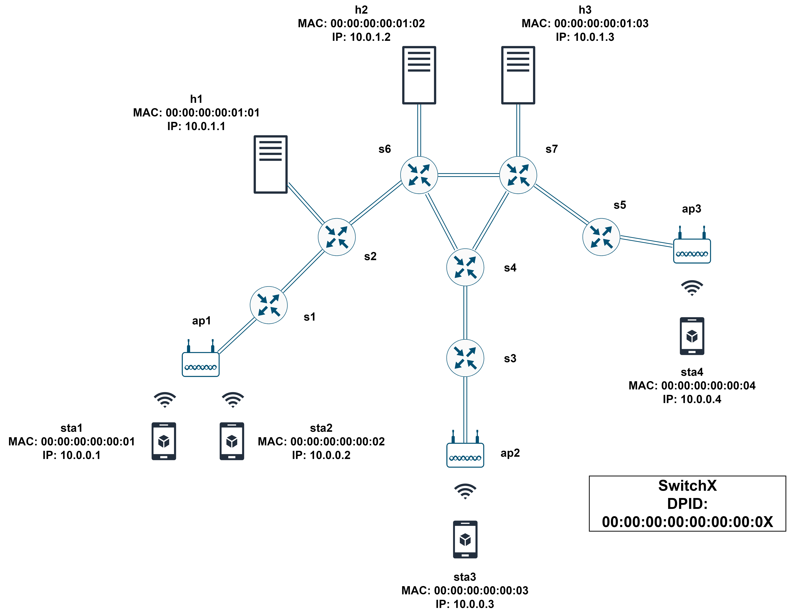

# SDN for mobility

## Overview
The repository is organized in the following way:
- _floodlight_ contains the source code of the Floodlight controller.
  The custom module is located in the _it.unipi.floodlight_ package.
- _mininet_ contains the scripts to generate the test topology in Mininet-WiFi and
  to inject the configuration in the controller via the REST interface.
- _asciimation-over-http_ contains a test application simulating a video 
  streaming between a client and a server.
  
The test topology is the one of the following figure:



## Requirements
- Floodlight requires Java 7 and Ant. The latter must support Java 7 (ex. version 1.9.X).
- Mininet-WiFi can be installed following the instructions in its [repository](https://github.com/intrig-unicamp/mininet-wifi).
- The test application and the script to inject the configuration in the controller require Python 3. 
  The required packages can be installed with pip:
    ```bash
    pip install -r requirements.txt
    ```
  If the nodes in Mininet-Wifi do not see the Flask package during the execution, please install it via apt:
    ```bash
    sudo apt-get install python3-flask
    ```

## Installation and execution
- Compile and execute Floodlight. In the _floodlight_ folder:
    ```bash
    ant
    sudo java -jar target/floodlight.jar
    ```
- Build the topology using Mininet-WiFi. In the _mininet_ folder:
    ```bash
    sudo python topology_generator.py
    ```
- If you don't want to load manually or customise the configuration in the controller, inject the provided one. 
  The script adds 3 users (sta1, sta2, sta3), the servers (h1, h2, h3) and the access
  switches (s1, s3, s5). In the _mininet_ folder:
  ```bash
  python configuration_injection.py
  ``` 
- Start the server application in one mininet node representing a server. For example, inside h1, 
  execute in the _asciimation-over-http_ folder:
  ```bash
  python server/movieserver.py --serverIP=10.0.1.1 --serverPort=5000
  ```
- Start the client application in one mininet node representing a station, targeting the virtual IP exposed 
  by Floodlight (by default 8.8.8.8). For example, inside sta1, execute in the _asciimation-over-http_ folder:
  ```bash
  python client/movieclient.py --movie=starwars --serverIP=8.8.8.8 --serverPort=5000
  ```

The scripts inside _mininet_ assume that the controller is running locally at 127.0.0.1,
allowing the exchange of Openflow messages through the port 6653 and exposing the REST interface
through the port 8080.
  
## Mobility scenario
A station can be moved spatially in two ways:
- _instantaneously_, operating on the Mininet-WiFi command line.
  For example, sta1 can be moved near ap2 with the command:
  ```
  mininet-wifi> py sta1.setPosition("60,30,0")
  ```
- _gradually_, adding custom lines inside the _topology_generator.py_ file.
  For example, sta1 can start moving towards ap2, when the topology is loaded,
  adding the lines:
  ```
  ...
  net.plotGraph(max_x=100, max_y=100)
  
  # Start mobility code.
  net.startMobility(time=0, ac_method="ssf")
  net.mobility(sta1, "start", time=30, position="15,30,0")
  net.mobility(sta1, "stop", time=40, position="60,30,0")
  net.stopMobility(time=45)
  # End mobility code.
  
  info("*** Starting network\n")
  net.build()
  ...
  ```
  This example is contained in _topology_generator_with_mobility.py_.
